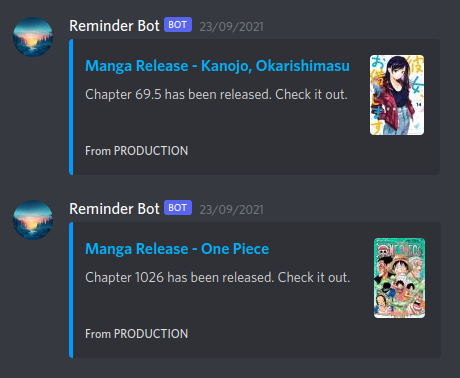
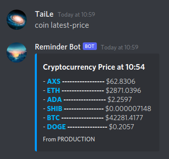

# Discord Reminder Bot

This project was created in order to:
1. Remind to read my favorite manga
2. Check price of cryptocurrency
3. Check my cryptocurrency wallet (in-development feature)
4. Check the lowest and highest price (in-development feature)
5. ???

I haven't had many ideas to make it more useful, please feel free to contact me if you have something to improve the bot.

### Technology

- Discord.js V13
- NodeJS
- PostgreSQL
- Prisma (ORM Framework)
- Puppeteer
- CoinMarketCap APIs (free version)
- Cron Job
- Heroku server


### Discord Bot setup

There is a saying: "Don't reinvent the wheel". This means there are a lot of tutorial out there to set up a Discord bot, I don't need to do it again. When I was doing this project, I followed the tutorials below here to complete the task:
1. [Set up a Discord Bot](https://www.youtube.com/watch?v=j_sD9udZnCk)
2. [Send and receive message](https://www.youtube.com/watch?v=nTGtiCC3iQM)

In general, they have several steps:
1. Create an Application in Discord
2. Create a Discord Bot in the Application
3. Grant permissions to the Bot and attach it to a Discord Server
4. Get the Bot's token to our NodeJS server
5. Sign in using that token in our server (checkout `discord.js` file)


### Database Overview & Setup

In this project, I use Prisma as the ORM Framework (it can connect to both SQL and NoSQL databases with minimal effort). You can easily see the `prisma` directory, it stores the migration files and database models that our application needs.

There are some models to cover my need:
- **User** _(contains Discord Id)_
- **Manga** _(contains interesting manga)_
- **MangaChapter**
- **Reminder**
- **Coin** _(contains interesting coins)_
- **PriceUpdate**
- **PriceUpdateConversion**

Before migrating the database, you need to create a database and prepare the `.env` file. Subsequently, we can migrate our database and seed data.

__Note:__ You should edit file `seed_manga.js` and `seed_coins.js` in your interest.

```
yarn install  # install node_modules first

npx prisma migrate dev  # migrate all changes in database

npm run db:seed  # seed data
```


### Code structure

- **prisma:** Database models, migrations, seeders
- **src:**
  - **jobs:** Cron and non-cron jobs for fetching data
  - **parsers:** Parse data from website to gather manga data
  - **platforms:** Serve as connector to Discord and maybe other communicating platforms
  - **services:** Handle logic and interact with database


### Web Crawling

To check the manga available in different websites, web crawling is used periodically with cron jobs. There are many libraries for crawling, but Axios and Puppeteer are my preferable technology. Axios is famously known for request invoking functionality. On the other hand, Puppeteer serves as a headless browser with Chromium API to overcome CDN.

You can see the code [here](https://github.com/tailtq/discord-reminder-bot/blob/master/src/parsers/base_parser.js#L29-L58).

__Example:__




### Cryptocurrency notification

I use CoinMarketCap APIs to get the data every 5 minutes and store it into database, you can check this file `src/jobs/cryptocurrency/fetch_coin_price.js`. It also sends the price update message to me in Discord if time is appropriate.

__Example:__




### In conclusion

Working on this project is so enjoyable. I will optimize and add more features as long as I am still interested in this idea. Thank you guys for reading.
